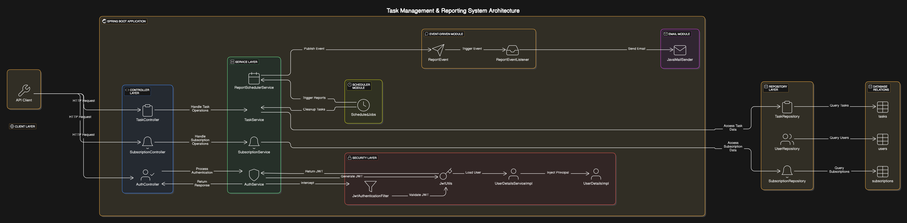
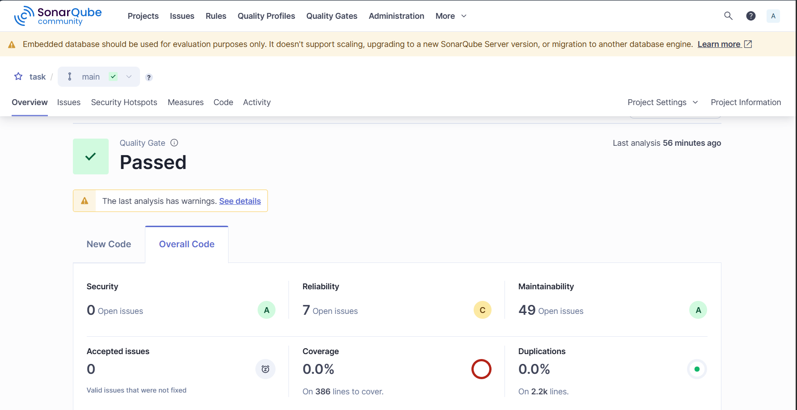

# 📘 Task Management & Reporting System Documentation

## 📌 Project Overview
A backend RESTful system designed using **Java Spring Boot**, allowing users to manage personal tasks, subscribe to automated reports, and trigger business logic via secure APIs. The application supports authentication, dynamic filtering, soft deletion with restoration, and scheduled notifications.

---

## 🧱 Architecture
- **MVC REST** layered structure
- **Spring Security** with JWT authentication
- **DTOs** for request/response abstraction
- **Custom Exception Handling** for robust feedback
- **Event-Driven Design** for subscription notifications
- **Scheduled Tasks** for automation

### 🧭 Architecture Diagram


### Folder Structure
```
src/
├── controller/             # Handles API endpoints
├── service/                # Business logic layer
├── model/
│   ├── entity/             # JPA entities (User, Task, Subscription)
│   └── dto/                # DTOs for API input/output
├── repository/             # Spring Data JPA interfaces
├── security/               # JWT filters & configurations
├── scheduler/              # Scheduled cron jobs
├── listener/               # Event listeners
├── util/                   # Enums, utilities, event classes
├── exception/              # Custom exceptions and handler
└── TaskApplication.java    # Main entry point
```

---

## ⚙️ Technologies Used
- Java 17
- Spring Boot 3.x
- Spring Security (JWT)
- Spring Data JPA
- Spring Mail
- Lombok
- Validation API (Jakarta)
- Maven
- SonarQube (for static analysis)
- Swagger (for full API documentation)

---

## 🚀 Prerequisites & How to Run

### Prerequisites for running 

#### locally
- Java 17 installed
- Maven installed
- MySQL database running (configure in `application.properties`)
- (Optional) SonarQube instance running locally or remotely for code analysis

#### containered
- MySQL database running (configure in `docker-compose.yaml`)
- Docker installed


### How to Run
```bash
# Clone the repo
$ git clone <your-repo-url>
$ cd task-management-system

# Build the application
$ mvn clean install

# Run the application
$ mvn spring-boot:run

# Access the API at
http://localhost:8080/api

# Swagger UI (if enabled)
http://localhost:8080/swagger-ui/index.html
```

> Make sure to configure your `application.properties` file with DB credentials and email SMTP settings.

---

## 🐳 Docker Setup

### Dockerfile (Multi-Stage Build)
- Builds app with Maven in first stage
- Runs the JAR in a clean OpenJDK 17 runtime

### Docker Compose Setup
- Launches both MySQL and the Spring Boot app

### Run via Docker
```bash
# Build and run containers
$ docker-compose up --build

# App: http://localhost:8080
# Swagger: http://localhost:8080/swagger-ui/index.html
```

### Docker Environment Variables
```yaml
# Database Configuration
SPRING_DATASOURCE_URL: jdbc:mysql://localhost:3306/task_management
SPRING_DATASOURCE_USERNAME: your_username
SPRING_DATASOURCE_PASSWORD: your_password
SPRING_JPA_HIBERNATE_DDL_AUTO: update
# Email Configuration for sending reports
EMAIl_USERNAME: your_email
EMAIL_PASSWORD: your_email_password
```

---

## 🔐 Authentication
| Endpoint | Method | Body |
|----------|--------|------|
| `/api/auth/signup` | POST | `{ "username", "email", "password" }`
| `/api/auth/signin` | POST | `{ "email", "password" }`

📌 Returns a JWT token on successful login or signup.

✅ **Handled Errors:**
- Invalid email format
- Incorrect password
- Missing fields

---

## ✅ Task Management API
| Endpoint | Method | Purpose | Protected? |
|----------|--------|---------|------------|
| `/api/tasks` | POST | Create a task | ✅ |
| `/api/tasks/{id}` | PUT | Update task | ✅ |
| `/api/tasks/{id}` | DELETE | Soft-delete task | ✅ |
| `/api/tasks` | DELETE | Batch delete by date | ✅ |
| `/api/tasks/restore` | POST | Restore last deleted task(s) | ✅ |
| `/api/tasks/{id}/complete` | PATCH | Mark task as completed | ✅ |
| `/api/tasks/{id}` | GET | Get single task by ID | ✅ |
| `/api/tasks` | GET | Get all tasks | ✅ |
| `/api/tasks/filters` | GET | Filter by date & status | ✅ |

📌 **Filtering Example:**
```
GET /api/tasks/filters?from=2025-04-01&to=2025-04-10&status=COMPLETED
```

✅ **Handled Errors:**
- Invalid date format
- Start date after due date
- Unauthorized user modifying another's task
- Invalid enum values (e.g., unknown status)

---

## 🔄 Safe Delete & Auto Cleanup
- Tasks are **soft deleted** and marked with `deletedAt`
- Latest batch or task can be **restored**
- Scheduled job deletes soft-deleted tasks after 24 hours automatically

---

## 📨 Subscription Management
| Endpoint | Method | Body | Purpose |
|----------|--------|------|---------|
| `/api/subscription` | POST | `{ "frequency": "DAILY", "reportHour": 7 }` | Subscribe user |
| `/api/subscription` | GET | — | View subscription |
| `/api/subscription` | DELETE | — | Unsubscribe user |

✅ **Handled Errors:**
- Subscribing twice → `AlreadySubscribedException`
- Invalid `@Min/@Max` for report hour
- Unsubscribing when not subscribed → `SubscriptionNotFoundException`

---

## 🕒 Scheduled Tasks
| Job | Frequency | Description |
|-----|-----------|-------------|
| Report sender | Hourly | Checks report hour and frequency to send task summaries via event listener |
| Soft-delete cleaner | Hourly | Deletes soft-deleted tasks older than 1 day |

---

## 🧠 Design Patterns
| Pattern | Applied In |
|--------|------------|
| Strategy | ReportFrequency enum switch logic |
| Observer (Pub/Sub) | Spring event publishing for reports |
| Template Method | Unified exception handling base class |
| DTO Adapter | Transforming entity to response objects |

---

## 📊 API Documentation & Static Code Analysis

### 🧞 API Documentation (Swagger)
- Full documentation with **Swagger (OpenAPI 3.0)**.
- Every endpoint includes:
  - Request/response examples
  - Validation constraints (min/max, enum, date formats)
  - Error scenarios with structured error responses
- 📄 Available via Swagger UI or importable JSON.

### 📬 Postman API Collection
Test the full API using Postman:
- Signup/Login
- Task CRUD + filters + complete
- Restore/delete
- Subscription endpoints

Includes valid and invalid examples to match real-life testing.

### 💪 Static Code Analysis (SonarQube)
- Enforces clean code using **SonarQube**.
- Highlights:
  - Code smells
  - Security issues
  - Test coverage (optional)
  - Clean architecture rules

#### 📸 SonarQube Dashboard 


---

## 👤 Author
**Amr Mourad**
> NTI DevOps | Java Spring Boot Developer